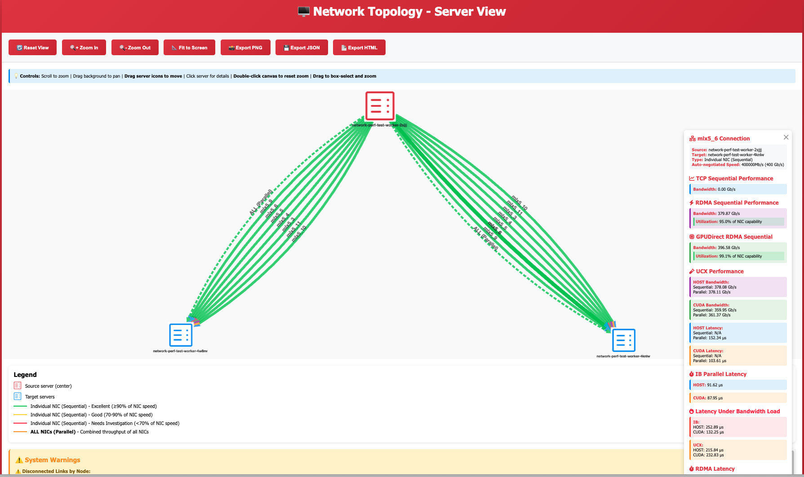

# Network Performance Testing

Comprehensive RDMA network performance testing suite for Kubernetes/OpenShift clusters with InfiniBand and GPUDirect RDMA validation.

## Table of Contents
- [Overview](#overview)
- [Quick Start](#quick-start)
- [What Gets Tested](#what-gets-tested)
- [Test Results & Report](#test-results--report)
- [Expected Results](#expected-results)
- [Configuration](#configuration)
- [Troubleshooting](#troubleshooting)

## Overview

Run these tests **AFTER** baremetal deployment completes to validate RDMA network performance, GPU-NIC topology, and GPUDirect RDMA functionality.

**Key Features:**
- Auto-discovers all RDMA shared devices
- Tests InfiniBand (IB) and UCX protocol stacks
- Validates GPUDirect RDMA performance
- GPU-NIC topology mapping for optimal performance
- Comprehensive latency testing (sequential, parallel, under-load)
- NCCL collective operations testing
- Interactive HTML report with color-coded performance indicators
- Network topology visualization

## Quick Start

### Deploy and Run Tests

```bash
# Apply all test resources
oc apply -k manifests/99-network-perf-tests

# Watch test progress
oc logs -f job/network-perf-test

# View web report (URL shown in logs)
# https://network-perf-report-default.apps.<cluster-domain>
```

### View Results

After tests complete (~30-40 minutes), access the interactive report:

```bash
# Get report URL
oc get route network-perf-report -o jsonpath='{.spec.host}'

# Open in browser
```

### Cleanup

```bash
# Delete test resources
oc delete -k manifests/99-network-perf-tests
```

## What Gets Tested

### 1. IB (InfiniBand Verbs) Tests

**Sequential Bandwidth Tests:**
- Tests each NIC individually (no contention)
- Tool: `ib_write_bw`
- Message size: 4MB
- Memory types: HOST and CUDA (GPUDirect)
- Expected: ~378 Gb/s per NIC

**Parallel Bandwidth Tests:**
- Tests all NICs simultaneously
- Shows aggregate throughput
- Memory types: HOST and CUDA
- Expected: Bandwidth sharing across NICs (~260-378 Gb/s per NIC for 7 NICs)

**Sequential Latency Tests:**
- Baseline latency measurement (one NIC at a time)
- Tools: `ib_write_lat` (HOST), `ib_send_lat` (CUDA)
- Iterations: 1000
- Expected: ~91 μs HOST, ~88 μs CUDA

**Parallel Latency Tests:**
- All NICs tested simultaneously (resource contention)
- Shows latency degradation from concurrent access
- Expected: ~92-160 μs HOST (contention), ~88-90 μs CUDA (minimal contention)

**Latency Under Bandwidth Load:**
- Latency measured while bandwidth is fully saturated
- Realistic worst-case scenario
- Expected: ~130-285 μs HOST (significant degradation), ~88-92 μs CUDA (minimal)

### 2. UCX (Unified Communication X) Tests

**Sequential Bandwidth Tests:**
- Higher-level communication library
- Tool: `ucx_perftest -t tag_bw`
- Message size: 4MB
- Memory types: HOST and CUDA
- Expected: ~377 Gb/s

**Parallel Bandwidth Tests:**
- All NICs simultaneously
- Iterations: 80,000 (HOST), 100 (CUDA)
- Expected: ~192-378 Gb/s per NIC (bandwidth sharing for 7 NICs)

**Sequential Latency Tests:**
- Tool: `ucx_perftest -t tag_lat`
- Expected: ~90-91 μs HOST, ~103-104 μs CUDA

**Parallel Latency Tests:**
- Iterations: 10,000
- Expected: ~110-160 μs HOST, ~103-105 μs CUDA

**Latency Under Bandwidth Load:**
- Duration-based saturation (60 seconds)
- Expected: ~152-360 μs HOST (proper degradation), ~232-236 μs CUDA

### 3. GPU-NIC Topology Mapping

- Uses `nvidia-smi topo -m` to detect optimal GPU-NIC pairs
- Maps each NIC to best GPU based on PCIe topology (PXB connections)
- Stores topology in SQLite database for runtime optimization
- Automatically uses optimal GPU for each NIC in CUDA tests

### 4. NCCL Collective Operations

**Per-Node Tests:**
- `all_reduce_perf`, `all_gather_perf`, `broadcast_perf`, `reduce_scatter_perf`
- Single-node multi-GPU performance

**Multi-Node Tests:**
- All NICs automatically configured
- GPUDirect RDMA enabled
- Environment variables pre-configured

## Test Results & Report

### Example Visualization

Here's an example of the interactive network topology visualization generated by the tests:



**Interactive Features:**
- Drag server icons to rearrange layout
- Click connections to see detailed performance metrics
- Color-coded links show performance health (green = excellent, yellow = good, red = needs investigation)
- Separate views for individual NIC performance and aggregate throughput
- Hover over elements for quick stats

👉 **[Open Interactive Example](examples/network-topology-example.html)** - Full HTML version with clickable elements and detailed metrics

### HTML Report Features

**Landing Page:**
- Test summary statistics
- Quick access to detailed results and topology

**Topology Visualization:**
- Interactive network diagram
- Color-coded performance indicators
- Per-NIC bandwidth and latency labels
- Aggregate metrics for all NICs combined

**Detailed Performance Tables:**
- Bandwidth results (sequential and parallel)
- Latency results (sequential, parallel, under-load)
- Color coding:
  - 🟢 **Green (High)**: Excellent performance (>340 Gb/s bandwidth, <95 μs latency)
  - 🟡 **Yellow (Medium)**: Fair performance (250-340 Gb/s bandwidth, 95-120 μs latency)
  - 🔴 **Red (Low)**: Poor performance (<250 Gb/s bandwidth, >120 μs latency)
- GPU-NIC topology information
- NCCL collective operation results

**Report Access:**
```bash
# Get URL
oc logs job/network-perf-test | grep "Open in browser"

# Or get route directly
echo "https://$(oc get route network-perf-report -o jsonpath='{.spec.host}')"
```

## Expected Results

### Bandwidth Performance

**IB Sequential (per NIC):**
- HOST: 376-380 Gb/s
- CUDA: 396-397 Gb/s (GPUDirect RDMA)

**IB Parallel (7 NICs simultaneously):**
- HOST: 342-379 Gb/s per NIC (some bandwidth sharing)
- CUDA: 396-397 Gb/s per NIC (minimal sharing)
- Aggregate: ~2,600 Gb/s HOST, ~2,770 Gb/s CUDA

**UCX Sequential (per NIC):**
- HOST: 376-378 Gb/s
- CUDA: 360-361 Gb/s

**UCX Parallel (7 NICs simultaneously):**
- HOST: 192-260 Gb/s per NIC (significant bandwidth sharing)
- CUDA: 360-361 Gb/s per NIC (minimal sharing)
- Note: HOST bandwidth shared across parallel UCX streams

### Latency Performance

**IB Sequential (Baseline):**
- HOST: 91-92 μs
- CUDA: 87-88 μs

**IB Parallel (Contention):**
- HOST: 91-160 μs (resource contention)
- CUDA: 87-90 μs (minimal contention)

**IB Under Bandwidth Load:**
- HOST: 128-285 μs (**2-3x degradation** under saturation)
- CUDA: 87-92 μs (minimal degradation, GPUDirect optimized)

**UCX Sequential:**
- HOST: 90-91 μs
- CUDA: 103-106 μs

**UCX Parallel:**
- HOST: 110-160 μs
- CUDA: 102-105 μs

**UCX Under Bandwidth Load:**
- HOST: 152-360 μs (**2-4x degradation**)
- CUDA: 232-236 μs (**2.2-2.3x degradation**)

### Key Insights

**Bandwidth Sharing:**
- When 7 NICs run in parallel, HOST bandwidth is shared
- CUDA bandwidth shows minimal sharing (GPU memory bandwidth not saturated)
- Expected behavior due to PCIe/CPU/memory bottlenecks

**Latency Degradation:**
- HOST latency significantly increases under load (realistic workload scenario)
- CUDA latency remains stable (GPUDirect RDMA bypasses CPU/system memory)
- UCX shows better stability than raw IB under certain conditions

**Performance Indicators:**
- Sequential > 375 Gb/s: 🟢 Excellent
- Parallel > 250 Gb/s (7 NICs): 🟢 Good (bandwidth sharing expected)
- Latency < 95 μs (sequential): 🟢 Excellent
- Latency < 300 μs (under load): 🟢 Acceptable

## Configuration

### Environment Variables

Edit `network-perf-test-main.yaml` to customize test behavior:

```yaml
env:
- name: TEST_DURATION
  value: "5"  # Bandwidth test duration (seconds)

- name: RUN_LATENCY_UNDER_LOAD
  value: "true"  # Enable latency-under-load tests (adds ~10-15 min)

- name: BW_DURATION
  value: "30"  # Bandwidth saturation duration for latency-under-load

- name: CLEANUP_WORKERS
  value: "false"  # Keep worker pods for debugging

- name: KEEP_COORDINATOR_ALIVE
  value: "true"  # Keep coordinator alive to serve web report
```

### Test Duration

**Default (~30-40 minutes for 3 nodes, 7 NICs):**
- IB sequential tests: ~3-4 minutes
- IB parallel tests: ~2-3 minutes
- UCX sequential tests: ~3-4 minutes
- UCX parallel tests: ~2-3 minutes
- Latency tests: ~5-7 minutes
- Latency-under-load tests: ~10-12 minutes (if enabled)
- NCCL tests: ~3-5 minutes
- Report generation: ~30 seconds

**Scaling:**
- 2 nodes: ~20-25 minutes
- 3 nodes: ~30-40 minutes
- 5 nodes: ~60-90 minutes

### Port Allocation

Tests use unique ports per NIC to prevent conflicts:

**IB Tests:**
- Sequential latency HOST: 19000-19099
- Sequential latency CUDA: 19100-19199
- Parallel bandwidth: 18515+
- Parallel latency HOST: 18715+
- Parallel latency CUDA: 18815+
- Latency-under-load BW HOST: 20000+
- Latency-under-load BW CUDA: 22000+
- Latency-under-load LAT HOST: 21000+
- Latency-under-load LAT CUDA: 23000+

**UCX Tests:**
- Sequential bandwidth: 13337+
- Parallel bandwidth: 13337+
- Parallel latency: 14337+
- Latency-under-load BW HOST: 24000+
- Latency-under-load BW CUDA: 25000+
- Latency-under-load LAT HOST: 26000+
- Latency-under-load LAT CUDA: 27000+

## Troubleshooting

### No RDMA Devices Found

```bash
# Check NVIDIA Network Operator
oc get pods -n nvidia-network-operator

# Check node resources
oc get nodes -o json | jq '.items[].status.allocatable' | grep rdma

# Verify RDMA shared device plugin
oc get pods -n nvidia-network-operator -l app=rdma-shared-dp

# Check MOFED drivers
oc debug node/<node> -- chroot /host ibstat
```

### Worker Pods Not Starting

```bash
# Check pod events
oc describe pod -l app=network-perf-test-worker

# Check RDMA resources available
oc get nodes -o json | jq '.items[] | {name: .metadata.name, rdma: .status.allocatable}'

# Verify InfiniBand interfaces
oc debug node/<node> -- chroot /host ibstatus
```

### Test Failures

**UCX Parallel Tests FAIL:**
- Check log files: `oc exec <pod> -- cat /tmp/ucx_mlx5_*_par_host.log`
- Verify "Final:" line is present in logs
- Common cause: Insufficient wait time for test completion
- Solution: Already fixed with 80k iterations + 30s wait

**Latency-Under-Load Shows No Degradation:**
- Verify bandwidth saturation is running during latency measurement
- Check `RUN_LATENCY_UNDER_LOAD=true` is set
- Increase `BW_DURATION` if needed
- Solution: Already fixed with `timeout 60 env` approach

**NCCL Tests Fail:**
- Check GPU availability: `oc exec <pod> -- nvidia-smi`
- Verify GPU operator deployed
- Check NCCL environment variables in pod

### Low Bandwidth Results

**Possible Causes:**
- Physical cabling issues
- InfiniBand switch configuration
- MOFED driver issues
- PCIe lane degradation
- CPU/memory bottlenecks

**Diagnosis:**
```bash
# Check InfiniBand status
oc exec <pod> -- ibstat

# Check PCIe link speed/width
oc exec <pod> -- lspci -vv -s <device>

# Check GPU-NIC topology
oc exec <pod> -- nvidia-smi topo -m

# Check for errors
oc exec <pod> -- ibv_devinfo -d mlx5_0
```

### High Latency Variation

**Possible Causes:**
- PCIe topology (NICs sharing PCIe switches)
- NUMA configuration mismatch
- Background network traffic
- Switch queue congestion

**Diagnosis:**
```bash
# Check PCIe topology
oc exec <pod> -- nvidia-smi topo -m

# Check NUMA nodes
oc exec <pod> -- numactl --hardware

# Review GPU-NIC topology in database
oc exec job/network-perf-test -- sqlite3 /tmp/network-perf-results.db \
  "SELECT * FROM gpu_nic_topology WHERE connection_type='PXB';"
```

## Prerequisites

- Baremetal deployment completed
- MOFED drivers installed on all worker nodes
- NVIDIA Network Operator deployed with RDMA shared device plugin
- GPU Operator deployed (for NCCL and GPUDirect tests)
- InfiniBand interfaces active and connected
- **BIOS configured for GPUDirect RDMA:**
  - IOMMU disabled (required for GPUDirect RDMA)
  - ACS disabled (pci=noacscheck kernel parameter)
  - PCIe peer-to-peer enabled

## Architecture

**Test Flow:**
1. Coordinator Job discovers RDMA shared devices
2. DaemonSet deploys worker pods on all nodes with GPUs
3. Coordinator detects RDMA devices on each pod
4. Builds GPU-NIC topology database
5. Runs comprehensive all-to-all tests:
   - IB sequential bandwidth/latency
   - IB parallel bandwidth/latency
   - UCX sequential bandwidth/latency
   - UCX parallel bandwidth/latency
   - Latency-under-load tests (if enabled)
   - NCCL collective operations
6. Generates interactive HTML report with topology visualization
7. Serves results via HTTPS web interface

**Database Schema:**
- SQLite database stores all test results
- `gpu_nic_topology`: Maps NICs to optimal GPUs
- `ib_results`, `ucx_results`: Bandwidth/latency data
- `latency_under_load_results`: Latency degradation data
- `nccl_results`: NCCL collective operation data

## Files

- `network-perf-test-main.yaml`: Main test coordinator Job
- `daemonset-template.yaml`: Worker pod template
- `web-service.yaml`: HTTPS route for web report
- `*-configmap.yaml`: Test scripts (IB, UCX, latency, NCCL, report generator)
- `kustomization.yaml`: Kustomize configuration

## Notes

- Tests run in `default` namespace
- Worker pods use DaemonSet (one per worker node)
- Requires privileged security context (IPC_LOCK, SYS_RESOURCE)
- Results stored in SQLite database (`/tmp/network-perf-results.db`)
- HTML report auto-generated with color-coded metrics
- Web server stays alive by default (set `KEEP_COORDINATOR_ALIVE=false` to disable)
- Manual cleanup required (worker pods not auto-deleted)
- For large clusters (10+ nodes), test duration scales linearly

## Legend

### Performance Color Coding

**Bandwidth:**
- 🟢 **Green (High)**: ≥ 340 Gb/s
- 🟡 **Yellow (Medium)**: 250-340 Gb/s
- 🔴 **Red (Low)**: < 250 Gb/s

**Latency (Sequential/Parallel):**
- 🟢 **Green (Excellent)**: < 95 μs
- 🟡 **Yellow (Fair)**: 95-120 μs
- 🔴 **Red (Poor)**: > 120 μs

**Latency (Under Load):**
- 🟢 **Green (Good)**: < 200 μs
- 🟡 **Yellow (Acceptable)**: 200-300 μs
- 🔴 **Red (Degraded)**: > 300 μs

### Test Types

**Sequential**: One NIC at a time (baseline performance, no contention)
**Parallel**: All NICs simultaneously (shows aggregate throughput and contention)
**Under Load**: Latency measured while bandwidth is saturated (realistic worst-case)

### Memory Types

**HOST**: System memory (DDR4/DDR5)
**CUDA**: GPU memory (GPUDirect RDMA, bypasses CPU)

### Protocols

**IB**: InfiniBand verbs (low-level, hardware-specific)
**UCX**: Unified Communication X (higher-level, better resource management)
